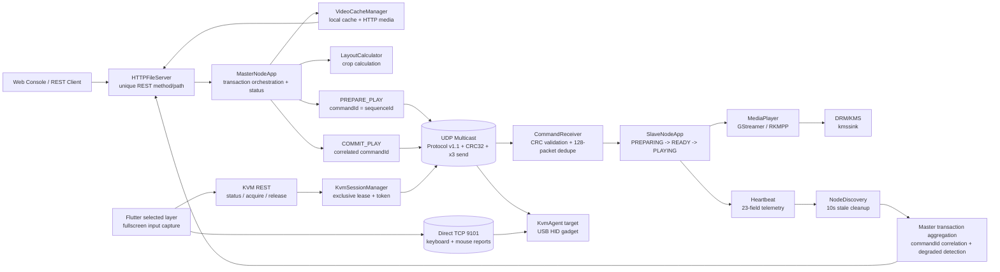
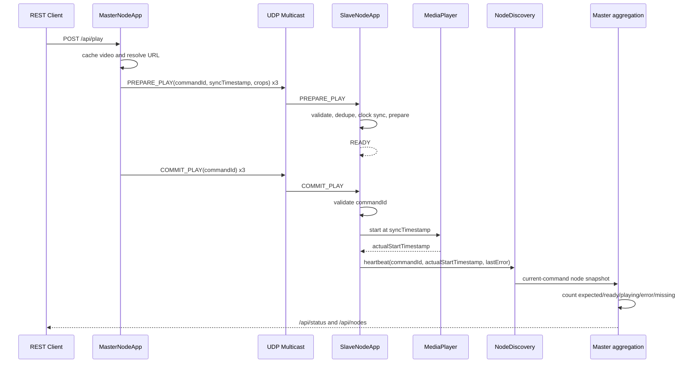

# Distributed Matrix System V1.0 Architecture

## 1. Overall architecture



## 2. Playback transaction sequence



## 3. Code tree

```text
D:\Distributed Matrix System
|-- include/common
|   |-- Protocol.h                 wire header, command registry, strict JSON schema
|   |-- NetworkOptions.h           multicast configuration
|   `-- SyncTimestampGenerator.h   Master clock offset conversion
|-- include/kvm
|   |-- KvmTypes.h                 roles, options, status and three-digit labels
|   |-- KvmSessionManager.h        exclusive leases and random session tokens
|   `-- KvmAgent.h                 controller/target data-plane Agent
|-- include/master
|   |-- CommandBroadcaster.h       PREPARE/COMMIT/STOP/PAUSE/RESUME
|   |-- MasterNodeApp.h            playback transaction and Master state
|   |-- NodeDiscovery.h            heartbeat receiver and node snapshots
|   `-- HTTPFileServer.h           single REST router
|-- include/node
|   |-- CommandReceiver.h          UDP receive, CRC, 128-packet dedupe
|   |-- MediaPlayer.h              GStreamer/RKMPP/DRM-KMS
|   `-- SlaveNodeApp.h             Slave state machine and heartbeat
|-- src/common/Protocol.cpp
|-- src/kvm
|   |-- KvmSessionManager.cpp
|   `-- KvmAgent.cpp
|-- src/master
|   |-- CommandBroadcaster.cpp
|   |-- MasterNodeApp.cpp
|   |-- NodeDiscovery.cpp
|   `-- HTTPFileServer.cpp
|-- src/node
|   |-- CommandReceiver.cpp
|   |-- SlaveNodeApp.cpp
|   `-- MediaPlayer.cpp
|-- tests
|   |-- core_tests.cpp             wire/schema/transaction tests
|   |-- component_tests.cpp        multicast/dedupe/heartbeat tests
|   |-- http_integration.sh        REST method/path and Range tests
|   `-- config_integration.sh       configuration strictness tests
`-- web/                            control console
```

## 4. State boundaries

- Master: `idle -> preparing -> scheduled -> playing`; heartbeat aggregation may expose `degraded` when current-command node reports are partial or erroneous. Controls can transition to `paused`, `stopped`, or `error`.
- Slave: `IDLE -> PREPARING -> READY -> PLAYING`.
- A COMMIT received before preparation finishes is retained for the matching transaction.
- A COMMIT with an unknown command ID is ignored and logged.
- Legacy `SYNC_PLAY` remains only as an internal compatibility path for existing tests; the Master V1.0 main path always sends PREPARE then COMMIT.
- Concurrent play/pause/resume/stop broadcasts are serialized by the Master command lock; a newer play replaces the active expected-node set.
- Heartbeat reports are correlated by `commandId`; stale reports from older transactions cannot satisfy the active transaction.
- KVM is independent of playback: Master owns only session arbitration and route/release control.
- The selected Flutter canvas layer determines the KVM target. HID reports flow directly from the
  client to that target over TCP; they do not traverse Master.
- One KVM lease is active system-wide. Expiration triggers an explicit release broadcast.
- KVM TCP uses one shared frame contract: `HELLO=1`, `KEYBOARD=2`, `MOUSE=3`, `ACK=4`,
  `PING=5`. A controller becomes active only after the target validates the route, opens both HID
  Gadget endpoints, and returns ACK. Flutter maintains the channel with one-second PING frames.
- The node ID is numeric in protocol/configuration and rendered as `001`, `002`, and so on in clients.

## 5. V1.0 hardening and non-goals

The current V1.0 hardening adds Master-side transaction aggregation over the existing strict
23-field heartbeat channel, stale-node cleanup, current-command correlation, node counters,
start-skew observability, and serialized control broadcasts. This is telemetry feedback, not
an ACK protocol: the system still does not claim UDP ACK closure/retry feedback, HMAC,
Master HA, PTP frame lock, leader election, or multi-Master conflict arbitration. It is a
professional engineering baseline, not the final commercial HA release. KVM V1 uses a random
session token on a trusted LAN and does not claim encrypted or Internet-exposed operation.
